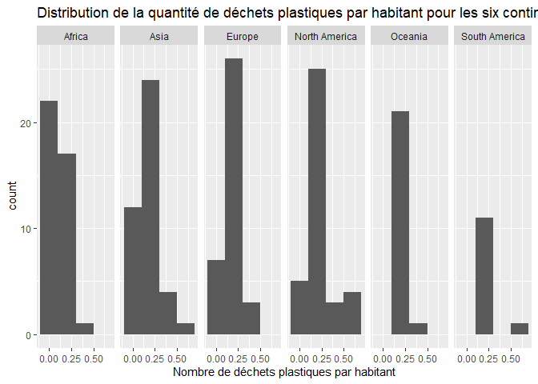
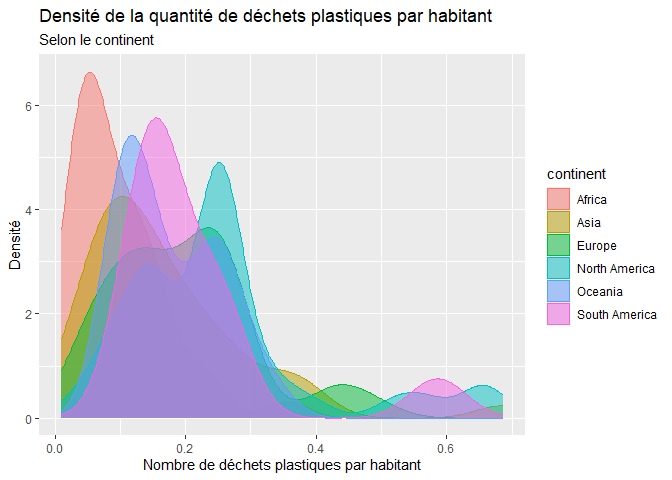

Lab 02 - Plastic waste
================
Catherine Noreau
22 septembre 2025

## Chargement des packages et des données

``` r
library(tidyverse) 
```

``` r
plastic_waste <- read_csv("data/plastic-waste.csv")
```

Commençons par filtrer les données pour retirer le point représenté par
Trinité et Tobago (TTO) qui est un outlier.

``` r
plastic_waste <- plastic_waste %>%
  filter(plastic_waste_per_cap < 3.5)
```

## Exercices

### Exercise 1

``` r
ggplot(plastic_waste, aes(x = plastic_waste_per_cap)) +
  geom_histogram (binwidth = 0.2) +
  facet_grid (~ continent)
```

<!-- -->
L’Amérique du nord contient le plus de pays avec un haut taux de déchets
plastiques par habitant. À l’inverse, l’Afrique est le continent qui
contient le plus de pays ayant la quantité de déchets plastiques par
habitant la moins élevée de l’histogramme.

### Exercise 2

``` r
ggplot(plastic_waste, aes(x = plastic_waste_per_cap, fill = continent)) +
 geom_density(alpha = 0.5)
```

<!-- -->

Le réglage de la couleur se trouve dans la partie aes du code puisqu’il
est appliqué en fonction d’une certaine catégorie. Chaque réponse à la
catégorie choisie possède sa propre couleur. En bref, c’est de
l’information supplémentaire sur la donnée donc c’est dans aes. Le
réglage de la transparence, quant à lui, est dans la partie geom_density
puisque c’est uniquement une caractéristique visuelle du graphique qui
ne donne pas d’information supplémentaire sur les données.

### Exercise 3

Boxplot:

``` r
# insert code here
```

Violin plot:

``` r
# insert code here
```

Réponse à la question…

### Exercise 4

``` r
# insert code here
```

Réponse à la question…

### Exercise 5

``` r
# insert code here
```

``` r
# insert code here
```

Réponse à la question…

## Conclusion

Recréez la visualisation:

``` r
# insert code here
```
