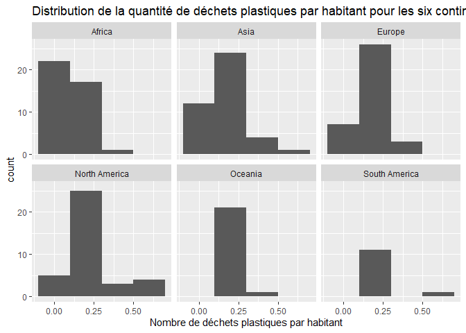

Lab 02 - Plastic waste
================
Catherine Noreau
22 septembre 2025

## Chargement des packages et des données

``` r
library(tidyverse) 
```

``` r
plastic_waste <- read_csv("data/plastic-waste.csv")
```

Commençons par filtrer les données pour retirer le point représenté par
Trinité et Tobago (TTO) qui est un outlier.

``` r
plastic_waste <- plastic_waste %>%
  filter(plastic_waste_per_cap < 3.5)
```

## Exercices

### Exercise 1

``` r
ggplot(plastic_waste, aes(x = plastic_waste_per_cap)) +
  geom_histogram (binwidth = 0.2) +
  facet_grid (~ continent) +
  labs(title = "Distribution de la quantité de déchets plastiques par habitant pour les six continents", x = "Nombre de déchets plastiques par habitant")
```

<!-- -->

L’Amérique du nord contient le plus de pays avec un haut taux de déchets
plastiques par habitant. À l’inverse, l’Afrique est le continent qui
contient le plus de pays ayant la quantité de déchets plastiques par
habitant la moins élevée de l’histogramme.

### Exercise 2

``` r
ggplot(plastic_waste, aes(x = plastic_waste_per_cap, fill = continent, color = continent)) +
 geom_density(alpha = 0.5) +
  labs(title = "Densité de la quantité de déchets plastiques par habitant", subtitle = "Selon le continent", x = "Nombre de déchets plastiques par habitant", y = "Densité")
```

<!-- -->

Le réglage de la couleur se trouve dans la partie aes du code puisqu’il
est appliqué en fonction d’une certaine catégorie. Chaque réponse à la
catégorie choisie possède sa propre couleur. En bref, aes permet
d’établir une correspondance entre une données et un élément esthétique.
Le réglage de la transparence, quant à lui, est dans la partie
geom_density puisque c’est uniquement une caractéristique visuelle du
graphique qui est indépendante des données.

### Exercise 3

Boxplot:

``` r
ggplot(plastic_waste, aes(x = continent, y = plastic_waste_per_cap)) +
  geom_boxplot() +
  labs(title = "Quantité de déchets plastiques par habitant vs Continent", x = "Continent", y = "Nombre de déchets plastiques par habitant")
```

<!-- -->

Violin plot:

``` r
ggplot(plastic_waste, aes(x = continent, y = plastic_waste_per_cap))+
  geom_violin() +
  labs(title = "Quantité de déchets plastiques par habitant vs Continent", x = "Continent", y = "Nombre de déchets plastiques par habitant")
```

<!-- -->

Les violin plots permettent de voir les valeurs pour lesquelles il y a
une plus grande concentration de données, ce qui n’est pas le cas des
boxplot.

### Exercise 4

``` r
ggplot(plastic_waste, aes(x = plastic_waste_per_cap, y = mismanaged_plastic_waste_per_cap, color = continent)) +
  geom_point() +
  labs(title = "Relation entre la quantité de déchets plastiques par habitant et la quantité de déchets non gérés par habitants", subtitle = "Selon le continent", x = "Nombre de déchets plastiques par habitant", y = "Nombre de déchets non gérés par habitant", color = "Continent")
```

<!-- -->

Les points colorés permettent bien d’observer la corrélation positive
entre le nombre de déchet gérés et le nombre de déchet non gérés pour
les pays d’un même continent. Autrement dit, plus les pays d’un
continent produisent de déchets, plus ils ont tendance à ne pas les
gérer.

### Exercise 5

``` r
ggplot(plastic_waste, aes(x = plastic_waste_per_cap, y = total_pop)) +
  geom_point() +
  labs(title = "Relation entre la quantité de déchets plastiques par habitant et le nombre total d'habitants", x = "Nombre de déchets plastiques par habitant", y = "Nombre total d'habitants")
```

    ## Warning: Removed 10 rows containing missing values or values outside the scale range
    ## (`geom_point()`).

<!-- -->

``` r
ggplot(plastic_waste, aes(x = plastic_waste_per_cap, y = coastal_pop)) +
  geom_point() +
  labs(title = "Relation entre la quantité de déchets plastiques par habitant et le nombre total d'habitants vivant près d'une côte", x = "Quantité de déchets plastiques par habitant", y = "Nombre total d'habitants vivant près d'une côte")
```

<!-- -->

La relation entre la quantité de déchets plastiques par habitant et le
nombre total d’habitants semble être plus forte que celle entre la
quantité de déchets plastiques par habitant et le nombre total
d’habitants vivant près d’une côte. En effet, les points du premiers
graphique sont plus concentrés près de l’axe des abscisses.

## Conclusion

Recréez la visualisation:

``` r
ggplot(plastic_waste %>% mutate(coastal_pop_prop = coastal_pop / total_pop) %>%
  filter(plastic_waste_per_cap < 3), aes(x = coastal_pop_prop, y = plastic_waste_per_cap)) +
  geom_point(aes(color = continent)) +
  geom_smooth(method = 'loess', se = TRUE, color = "black", fill = "grey") +
  labs(title = "Quantité de déchets plastiques vs Proportion de la population côtière", subtitle = "Selon le continent", x = "Proportion de la population côtière (Coastal / total population)", y = "Nombre de déchets plastiques par habitant", colour = "Continent")
```

    ## `geom_smooth()` using formula = 'y ~ x'

    ## Warning: Removed 10 rows containing non-finite outside the scale range
    ## (`stat_smooth()`).

    ## Warning: Removed 10 rows containing missing values or values outside the scale range
    ## (`geom_point()`).

<!-- -->
